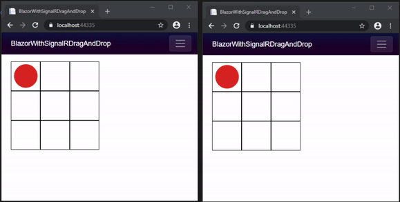

# Blazor WebAssembly App with Realtime SignalR Connection Demo (with Drag & Drop)

Simple implementation of Blazor drag & drop functionality paired with realtime SignalR updates.

## View Realtime Updates with SignalR
1. Run the app (with or without debugging).
2. Copy the URL from the address bar and paste into a new tab.
3. Both tabs will update as the circle is moved to a new cell in the grid.

  

## Additional Resources
* [SignalR with Blazor Webassembly](https://docs.microsoft.com/en-us/aspnet/core/tutorials/signalr-blazor-webassembly?view=aspnetcore-3.1&tabs=visual-studio)
* [Blazor Drag & Drop](https://chrissainty.com/investigating-drag-and-drop-with-blazor/)
